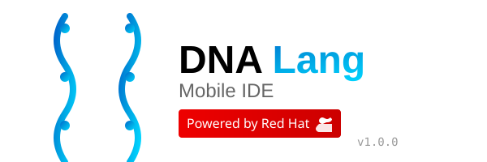

# DNA Lang Mobile IDE

<div align="center">



**Cloud-Native Mobile IDE for DNA Programming Language**

**Powered by Red Hat OpenShift Dev Spaces**

[](https://redhat.com)
[](https://www.redhat.com/en/technologies/cloud-computing/openshift)
[](https://www.typescriptlang.org/)
[](https://reactjs.org/)

</div>

---

## 🧬 About DNA Lang

DNA Lang is a revolutionary **Techno-Biological Programming Language** designed for **autonomous quantum computing research** and **self-evolving systems**. The DNA Lang Mobile IDE brings the power of the **Negentropic Quantum Research Engine (NQRE)** to your mobile devices and cloud environments, leveraging the robust infrastructure of **Red Hat OpenShift**.

### NQRE: Negentropic Quantum Research Engine

The NQRE is an **autonomous platform** that accelerates scientific breakthroughs in quantum computing through:

- **Autopoietic Systems**: Self-creating, self-maintaining organisms
- **Three-Tiered Architecture**: SENSE, ACT, EVOLVE cycle for autonomous research
- **Quantum-Native**: First-class support for quantum circuits and operations
- **LLM-Integrated**: Uses AI for insight generation and optimization
- **Wasserstein Optimization**: Quantum-aware optimization using optimal transport theory

## ✨ Features

### 🎯 Core Features
- **Mobile-First Design** - Optimized for tablets and mobile devices
- **Cloud-Native** - Runs seamlessly on Red Hat OpenShift Dev Spaces
- **Real-Time Code Execution** - Instant feedback with DNA Lang interpreter
- **Syntax Highlighting** - Powered by CodeMirror with DNA Lang support
- **File Management** - Built-in file explorer and project management
- **Integrated Terminal** - View execution output and errors in real-time

### 🧬 DNA Lang Capabilities
- **Quantum Computing**: Native quantum circuit support with SENSE-ACT-EVOLVE architecture
- **Self-Evolution**: Organisms that modify their own code for optimization
- **LLM Integration**: Gemini AI for autonomous insight generation
- **Wasserstein Gradient Flow**: Advanced quantum circuit optimization
- **Bio-Inspired Computing**: DNA sequence analysis and genetic algorithms
- **Autonomous Research**: 24/7 operation with self-improvement

### ⚛️ Quantum Features
- **Quantum Circuits**: Define and execute quantum circuits with native syntax
- **Backend Support**: IBM Quantum, simulators, and cloud quantum computers
- **Coherence Monitoring**: Real-time tracking of quantum state quality
- **Error Mitigation**: Built-in quantum error correction
- **State Tomography**: Full quantum state reconstruction
- **VQE & QAOA**: Variational quantum algorithms

### 🔴 Red Hat Integration
- **OpenShift Ready** - Deploy with one command on OpenShift
- **Dev Spaces Compatible** - Full devfile.yaml configuration
- **PatternFly UI** - Red Hat's design system for consistent UX
- **UBI-based Containers** - Universal Base Image for security and compliance
- **Enterprise Support** - Built for production workloads

## 🚀 Quick Start

### Option 1: Red Hat OpenShift Dev Spaces (Recommended)

1. Open your Red Hat OpenShift Dev Spaces dashboard
2. Click **"Create Workspace"**
3. Import this repository URL
4. Dev Spaces will automatically provision your environment using the `devfile.yaml`
5. Start coding immediately!

### Option 2: Local Development

```bash
# Clone the repository
git clone <repository-url>
cd dna-lang-mobile-ide

# Install dependencies
npm install

# Start development server
npm run dev

# Open http://localhost:3000
```

### Option 3: Deploy to OpenShift

```bash
# Login to OpenShift
oc login <your-openshift-cluster>

# Create new project
oc new-project dnalang-ide

# Deploy the application
oc apply -f .openshift/deployment.yaml
oc apply -f .openshift/buildconfig.yaml

# Build from source
oc start-build dnalang-mobile-ide --from-dir=. --follow

# Get the route URL
oc get route dnalang-mobile-ide
```

## 📦 Project Structure

```
dna-lang-mobile-ide/
├── .openshift/              # OpenShift deployment configurations
│   ├── deployment.yaml      # Kubernetes deployment manifest
│   └── buildconfig.yaml     # OpenShift build configuration
├── bin/                     # DNA Lang CLI tools
│   ├── dnalang-compiler.js  # Command-line compiler
│   └── dnalang-repl.js      # Interactive REPL
├── public/                  # Static assets
│   ├── dnalang-logo.svg     # DNA Lang logo
│   ├── dnalang-redhat-logo.svg  # Combined branding
│   └── icons/               # PWA icons
├── docs/                    # Documentation
│   ├── DNALANG_SPECIFICATION.md  # Language specification
│   └── NQRE_GUIDE.md        # NQRE user guide
│   ├── examples/                # DNA Lang examples
│   ├── quantum-swarm-example.ts # NQRE organism example
│   └── simple-quantum-organism.dna # DNA Lang syntax example
├── src/
│   ├── components/          # React components
│   │   ├── Editor.tsx       # CodeMirror-based editor
│   │   ├── Terminal.tsx     # Output terminal
│   │   └── FileExplorer.tsx # File management
│   ├── dnalang/            # DNA Lang runtime
│   │   ├── executor.ts     # Code execution engine
│   │   ├── lexer.ts        # Lexical analyzer
│   │   ├── parser.ts       # Syntax parser
│   │   ├── ast.ts          # Abstract syntax tree
│   │   └── nqre/           # NQRE framework
│   │       ├── types.ts    # Type definitions
│   │       ├── sense.ts    # SENSE module
│   │       ├── act.ts      # ACT module
│   │       ├── evolve.ts   # EVOLVE module
│   │       ├── organism.ts # Organism runtime
│   │       └── index.ts    # Main exports
│   ├── store/              # State management
│   │   └── useStore.ts     # Zustand store
│   ├── styles/             # CSS styles
│   ├── App.tsx             # Main application
│   └── main.tsx            # Entry point
├── devfile.yaml            # Red Hat Dev Spaces configuration
├── Dockerfile              # Container image definition
├── package.json            # Node.js dependencies
└── vite.config.ts          # Vite build configuration
```

## 🧬 DNA Lang Examples

### Quantum Organism (NQRE)

```dnalang
ORGANISM QuantumSwarm {
  domain: "quantum_computing"
  version: "1.0.0"

  STATE {
    coherence: 0.0,
    generation: 0
  }

  DNA {
    quantum: {
      backend: "simulator",
      target_coherence: 0.99,
      qubit_count: 5
    }
  }

  CIRCUIT BellState {
    qubits: 2

    GATES {
      H(0)
      CNOT(0, 1)
    }

    MEASURE {
      q0: 0,
      q1: 1
    }
  }

  SENSE CoherenceMonitor {
    ASYNC FUNCTION monitor(): Metric {
      LET state = AWAIT GET_QUANTUM_STATE()
      RETURN COMPUTE_COHERENCE(state)
    }
  }

  ACT QuantumExperiment {
    ASYNC FUNCTION run(circuit: QuantumCircuit): Result {
      RETURN AWAIT BACKEND.EXECUTE(circuit)
    }
  }

  EVOLVE POLICY AutoImprove {
    TRIGGER {
      WHEN STATE.coherence < DNA.quantum.target_coherence * 0.9
    }

    ASYNC ACTION {
      LET mutation = AWAIT LLM.PROPOSE_MUTATION({
        goal: "maximize_coherence"
      })
      SELF.MODIFY(mutation)
    }
  }

  ASYNC FUNCTION main() {
    AWAIT MainLoop.run()
  }
}
```

### TypeScript Integration

```typescript
import { createOrganism, OrganismRuntime } from './src/dnalang/nqre'

// Create quantum organism
const organism = createOrganism({
  domain: 'quantum_computing',
  dna: {
    quantum: {
      backend: 'simulator',
      target_coherence: 0.99,
      qubit_count: 5
    }
  }
})

// Start autonomous research
const runtime = new OrganismRuntime(organism)
await runtime.start()
```

### Quantum Circuit Optimization

```dnalang
GENE WGFOptimizer {
  name: "Wasserstein Gradient Flow Optimizer"

  FUNCTION optimize(circuit: QuantumCircuit): QuantumCircuit {
    LET current = circuit

    WHILE iteration < max_iterations {
      LET gradient = COMPUTE_WASSERSTEIN_GRADIENT(current)
      current = APPLY_GRADIENT_UPDATE(current, gradient, learning_rate)

      IF NORM(gradient) < convergence_threshold {
        BREAK
      }
    }

    RETURN current
  }
}
```

## 🛠️ Development

### Available Scripts

```bash
# Development
npm run dev              # Start dev server
npm run build            # Build for production
npm run preview          # Preview production build

# Testing
npm test                 # Run tests
npm run test:ui          # Run tests with UI

# Linting
npm run lint             # Lint code
npm run format           # Format code with Prettier

# Type checking
npm run typecheck        # Check TypeScript types

# DNA Lang CLI
npm run dnalang:compile  # Compile DNA Lang file
npm run dnalang:repl     # Start DNA Lang REPL

# OpenShift
npm run openshift:deploy # Deploy to OpenShift
```

### Technology Stack

| Category | Technology |
|----------|-----------|
| **Frontend** | React 18, TypeScript 5.3 |
| **Editor** | CodeMirror 6 |
| **UI Framework** | PatternFly (Red Hat Design System) |
| **State Management** | Zustand |
| **Build Tool** | Vite 5 |
| **Container Runtime** | Node.js 18 on UBI8 |
| **Orchestration** | Red Hat OpenShift |
| **Cloud IDE** | Red Hat OpenShift Dev Spaces |

## 🔴 Red Hat OpenShift Integration

### devfile.yaml Configuration

The project includes a comprehensive `devfile.yaml` that defines:

- **Universal Developer Image** - Red Hat's UDI with Node.js and tools
- **VS Code Integration** - Red Hat branded VS Code editor
- **DNA Lang Runtime** - Dedicated container for code execution
- **Pre-configured Commands** - Build, run, test, and DNA Lang tools
- **Resource Limits** - Production-ready resource allocation

### OpenShift Features Used

- ✅ **Routes** - Automatic HTTPS routing
- ✅ **Services** - Internal service discovery
- ✅ **Deployments** - Rolling updates and scaling
- ✅ **BuildConfigs** - Source-to-Image (S2I) builds
- ✅ **ImageStreams** - Container image management
- ✅ **Health Checks** - Liveness and readiness probes

## 📱 Mobile Optimization

- **Responsive Design** - Works on all screen sizes
- **Touch-Optimized** - Mobile-friendly controls
- **Progressive Web App** - Install on home screen
- **Offline Support** - Service worker caching
- **Mobile Keyboards** - Optimized for touch input

## 🎨 Branding

The DNA Lang Mobile IDE incorporates both DNA Lang and Red Hat branding:

- **Logo Design** - DNA double helix with code brackets
- **Color Scheme** - DNA Lang blue (#0066cc) + Red Hat red (#ee0000)
- **Typography** - Red Hat Display, Text, and Mono fonts
- **UI Components** - PatternFly design system

## 📄 License

Apache-2.0

## 🤝 Contributing

We welcome contributions! This project is built with Red Hat's open source philosophy.

1. Fork the repository
2. Create your feature branch (`git checkout -b feature/AmazingFeature`)
3. Commit your changes (`git commit -m 'Add some AmazingFeature'`)
4. Push to the branch (`git push origin feature/AmazingFeature`)
5. Open a Pull Request

## 🆘 Support

- **Documentation** - [Red Hat Developer](https://developers.redhat.com/)
- **OpenShift Docs** - [OpenShift Documentation](https://docs.openshift.com/)
- **Dev Spaces** - [Dev Spaces Guide](https://access.redhat.com/products/red-hat-openshift-dev-spaces)
- **Issues** - Report issues in the GitHub issue tracker

## 🌟 Acknowledgments

Built with:
- ❤️ Red Hat OpenShift
- 🧬 DNA Lang Community
- ⚛️ React and TypeScript
- 🎨 PatternFly Design System

---

<div align="center">

**Made with ❤️ by the DNA Lang Team**

**Powered by Red Hat OpenShift Dev Spaces**

[](https://redhat.com)

</div>
